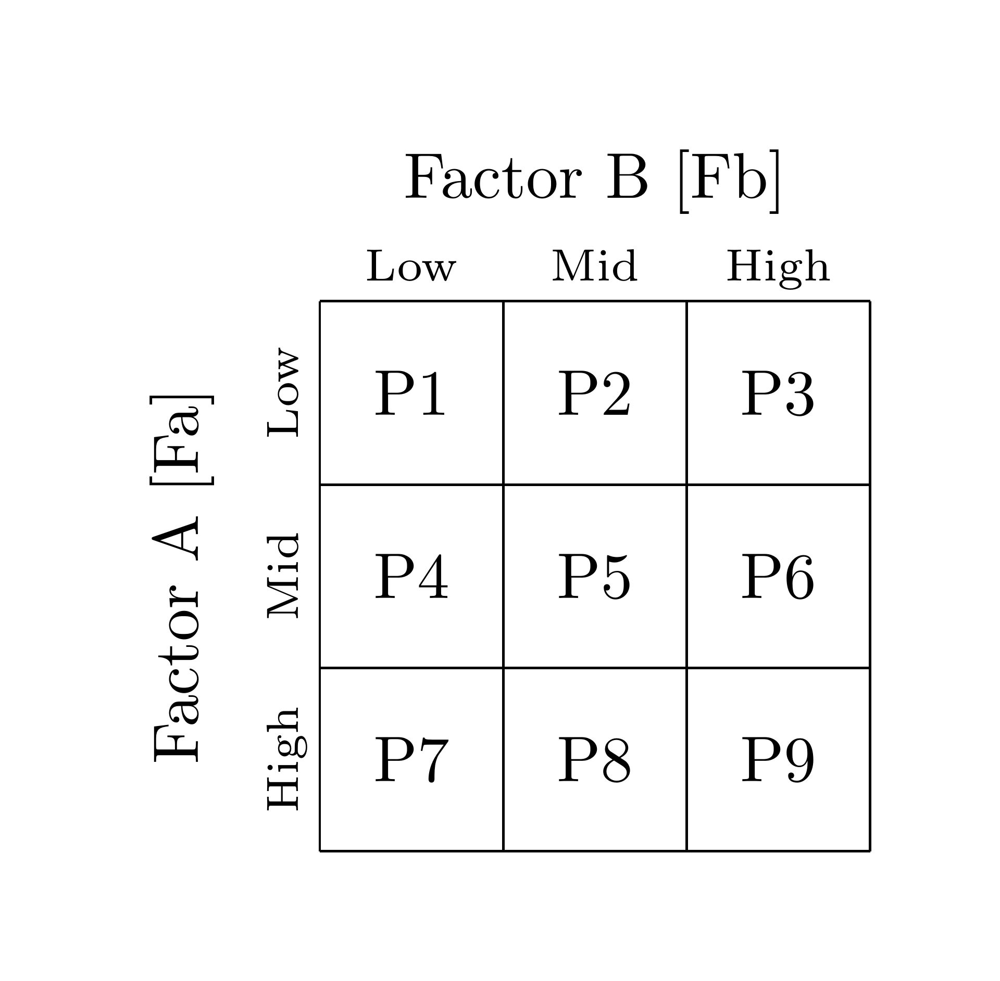

<style>
p.caption {
  font-size: 2em;
}
</style>


```{r setup, include=FALSE}
knitr::opts_chunk$set(echo = TRUE)
```

# 1 Introduction and Motivation for 'portsort'

Portfolio sorts have been a key part of empirical financial research since the 1970s.  Sorting procedures are used extensively in identifying and exploring relationships between expected returns and asset class characteristics.  The portfolio sorting approach has become widely used and is currently the dominant approach in empirical finance to test for and establish cross-sectional relationships between expected asset returns and asset characteristics.  Past empirical work featuring portfolio sorts include the use of price-to-earnings ratios @basu1977investment, book-to-market values @fama1992cross, firm size @banz1981relationship, volatility @ang2006cross, cross-sectional momentum @jegadeesh1993returns and host of over featuring factors such as liquidity, default risk and downside risk (Value-at-Risk, Lower Partial Moments etc.).  

The portsort R package includes functionality for both a conditional sort and an unconditional sort up to the third dimension, i.e assets can be grouped by up to three factors.  After the sorting procedure has been conducted, there is further functionality to analyse the turnover, relative frequency of the assets in each sub-portfolio and the mean sub-portfolio size.  

The generic approach in empirical finance is to first sort assets based on some factor into multiple sub-portfolios at some formation point and then examine the out-of-sample performance of these sub-portfolios.  Often, long-short zero-cost portfolios are constructed by initiating positions in the top and bottom sub-portfolios (in the case of a univariate sort).  The portsort package simplifies this process by allowing the user to automatically backtest univariate, double and triple-sorted portfolios.  The output of the core sorting functions includes the out-of-sample sub-portfolio returns and a list of the assets in each sub-portfolio.  From this, you can create trading strategies (long-short portfolios), pass the sub-portfolios to a regression analysis or conduct further analysis on the sub-portfolios themselves.  The primary goal of the package is to offer academic researchers, students and practitioners an easy way to conduct the portfolio sort procedure.  

# 2 Conducting Conditional and Unconditional Sorts

The portsort package offers functionality for both a conditional and unconditional sort - a concept that is still, for unknown reasons, glossed over by most lecturers in undergraduate and MBA financial economics coursework.  The differences can be profound and have a major impact on the out-of-sample portfolio results.  In the case of a univariate portfolio sort, the results are identical, however, higher dimension sorts will differ markedly.     

### 2.1 Conditional Sorting Procedure 
The conditional sorting procedure is best explained by example.  Assume an asset manager has identified two stock factors which he/she thinks are drivers of expected stock returns due to prior statistical analysis.  Let factor one (Fa) be market capitalization and factor two (Fb) be the book-to-market ratio.  A conditional double sort strongly depends on which factor the asset manager decides to sort the stocks by first.  Let us assume that the manager thinks that market capitalization has a stronger effect on expected returns.  At time  *t*, stocks are first sorted into *n* sub-portfolios based on market capitalization.  Instead of using quantile break-points, the manager decides to form 3 sub-portfolios (tercile portfolios).  The result is 3 sub-portfolios sorted from low to high based on market capitalization (a basic univariate sort).  Now, within these 3 sub-portfolios, the manager decides to sort each sub-portfolio into a further *m* sub-portfolios based on the book-to-market ratio.  Let us assume the manager decides on terciles for ease of interpretation.  This means that the stocks within each market capitalization sub-portfolio are further sorted from low to high resulting in 3 book-to-market sorted sub-portfolios within the market capitalization sorted sub-portfolio tercile.  Overall, 9 sub-portfolios are formed (there are 3 book-to-market sorted portfolios within each market capitalization sorted tercile).  Any arbitrary number of sub-portfolios can be constructed based on the dimensions of each sort.  The maximum amount of sub-portfolios in the case of a double sort is *n x m* and in the case of a triple sort *n x m x z*.   


### 2.2 Unconditional Sorting Procedure 
In an unconditional sort, the order of the sort does not matter, i.e the manager will get the same results regardless of the sort order.  Using the example above, Fa and Fb are sorted independently (at the same time) into terciles.  This results in 'Sort 1' which is the stock universe sorted by market capitalization from low to high.  These same stocks (regardless of the first sort) are sorted into book-to-market terciles called 'Sort 2'.  We now have two univariate sorts stored in tercile portfolios which are sorted independently of each other.  This is the crucial difference between a conditional and unconditional sort - the double or triple sorting procedure is based on the intersection between each sub-portfolio (in this case terciles).  For example, if stock 1, 23 and 40 is in the 1st market capitalization tercile, while stock 1, 20 and 43 is in the 1st book-to-market tercile, the 'L1-L1' sub-portfolio would only contain stock 1 and stock 43.  The result is that each sub-portfolio will contain stocks that are the intersection of each independently sorted sub-portfolio.  

### 2.3 Impact on Sub-Portfolios
The key difference between the two sorting procedures is that in a conditional sort, the factor which is sorted on first impacts the second sort.  This means that the sub-portfolios formed within the portfolios formed by the first sort are 'conditional' on the first factor.  This may seem obvious, but will result in large differences between sub-portfolios formed in the unconditional sorting process.  In the case of the conditional sort, the factor that is sorted on first will have a much greater influence on forward returns than the the other factors that are subsequently sorted conditional on the first factor sort.     


# 3. Functions included in portsort

### 3.1 conditional.sort and unconditional.sort
Both functions compute either a univariate, double or triple dimension sort.  Function output includes an xts object of sub-portfolio returns and a list of the sub-portfolios.  Both the conditional and unconditional sorts are pre-built to sort from low to high so that the interpretation of the out-of-sample return xts object is easier.  For example, a double sort with dimension *3 x 3* (i.e there are 3 break-points for each factor) is conducted with Fa and Fb.  A graphical depiction of the sort is shown below:

```{r pressure, echo=FALSE, fig.cap="Portfolio composition matrix",fig.align='center', out.width = '50%'}

```

<!--  -->

The out-of-sample returns for each sub-portfolio are stored in columns 1 to 9 of the output matrix.  Column 1 includes the returns for the 'Low-Low' sub-portfolio, column 4 includes returns for the 'Mid-Low' sub-portfolio whilst column 9 includes the 'High-High' sub-portfolio returns.  The dimension of each sort can be defined with user-defined break-points.

```{r, echo=TRUE, message=FALSE, warning = FALSE}
# Load the portsort package and the pre-loaded data
library(portsort)
library(PerformanceAnalytics)
library(xts)
data(Factors)
# Lagged returns, lagged volumes are stored in the Factors list
R.Forward = Factors[[1]]; R.Lag = Factors[[2]]; V.Lag = Factors[[3]]
Fa = R.Lag; Fb = V.Lag
#Specify the dimension of the sort - let's use terciles
dimA = 0:3/3;dimB = 0:3/3;dimC = c(0,1)
# Run the conditional sort with quantiles computed using method 7 from the quantile function (stats package)
sort.output.con = conditional.sort(Fa,Fb,Fc=NULL,R.Forward,dimA,dimB,dimC,type = 7)
# Run the unconditional sort with quantiles computed using method 7 from the quantile function (stats package)
sort.output.uncon = unconditional.sort(Fa,Fb,Fc=NULL,R.Forward,dimA,dimB,dimC, type = 7)

# Compare the risk and return of each sub-portfolio using PerformanceAnalytics
# Set the scale to 365 (Cryptocurreny markets have no close) and geometric to FALSE (we are using log returns)
table.AnnualizedReturns(sort.output.con$returns, scale = 365, geometric = FALSE, digits = 3)
table.AnnualizedReturns(sort.output.uncon$returns, scale = 365, geometric = FALSE, digits = 3)
```

### 3.2 portfolio.turnover
The portfolio.turnover function takes the output of either the conditional or unconditional sort and returns a list which includes an xts object with the turnovers for each rebalancing period and the mean turnover for each asset over time.


```{r, echo=TRUE, message=FALSE, warning = FALSE}
# Load the portsort package and the pre-loaded data
library(portsort)
library(PerformanceAnalytics)
library(xts)
data(Factors)
# Lagged returns, lagged volumes are stored in the Factors list
R.Forward = Factors[[1]]; R.Lag = Factors[[2]]; V.Lag = Factors[[3]]
Fa = R.Lag; Fb = V.Lag
#Specify the dimension of the sort - let's use terciles
dimA = 0:3/3;dimB = 0:3/3;dimC = c(0,1)
# Run either the conditional or unconditional sort function 
sort.output = conditional.sort(Fa,Fb,Fc=NULL,R.Forward,dimA,dimB,dimC)
# Run the turnover function
turnover.output = portfolio.turnover(sort.output)
turnover.output$`Mean Turnover`
```

### 3.3 portfolio.frequency
The portfolio.frequency functions takes as input a rank and the output of one of the sorting functions.  The function computes how many times a given asset appeared in every sub-portfolio based on the rank input.

```{r, echo=TRUE, message=FALSE, warning = FALSE}
# Load the portsort package and the pre-loaded data
library(portsort)
library(PerformanceAnalytics)
library(xts)
data(Factors)
# Lagged returns, lagged volumes are stored in the Factors list
R.Forward = Factors[[1]]; R.Lag = Factors[[2]]; V.Lag = Factors[[3]]
Fa = R.Lag; Fb = V.Lag
#Specify the dimension of the sort - let's use terciles
dimA = 0:3/3;dimB = 0:3/3;dimC = c(0,1)
# Run either the conditional or unconditional sort function 
sort.output = conditional.sort(Fa,Fb,Fc=NULL,R.Forward,dimA,dimB,dimC)
# Run the portfolio.frequency function with rank = 1
# to see which cryptocurrency appeared the most in each sub-portfolio
portfolio.frequency(sort.output, rank = 1)
# To see which crypto pair appeared the second most, set rank = 2 
portfolio.frequency(sort.output, rank = 2)
```

### 3.4 mean.portfolio.size

```{r, echo=TRUE, message=FALSE, warning = FALSE}
# Load the portsort package and the pre-loaded data
library(portsort)
library(PerformanceAnalytics)
library(xts)
data(Factors)
# Lagged returns, lagged volumes are stored in the Factors list
R.Forward = Factors[[1]]; R.Lag = Factors[[2]]; V.Lag = Factors[[3]]
Fa = R.Lag; Fb = V.Lag
#Specify the dimension of the sort - let's use terciles
dimA = 0:3/3;dimB = 0:3/3;dimC = c(0,1)
# Run the conditional sort function 
sort.output.con = conditional.sort(Fa,Fb,Fc=NULL,R.Forward,dimA,dimB,dimC)
# Run the unconditional sort function 
sort.output.uncon = unconditional.sort(Fa,Fb,Fc=NULL,R.Forward,dimA,dimB,dimC)

# Investigate mean portfolio size - conditional sort
portfolio.mean.size(sort.output = sort.output.con)

# Investigate mean portfolio size - unconditional sort
portfolio.mean.size(sort.output = sort.output.uncon)
```

# 4 Empirical Example using Cryptocurrencies

### 4.1 Univariate Sort with Cross-Sectional Momentum 
Cross-sectional momentum was popularized by @jegadeesh1993returns.  First, an asset's return momentum is computed by summing the asset's log return over the prior *s*-periods.  A skip period *k* is often used to remove the prior *k*-periods to account for possible short-term reversals.  A cross-sectional momentum strategy using the methodology of @jegadeesh1993returns can easily be constructed using the functionality of portsort.  

```{r, echo=TRUE, message=FALSE, warning = FALSE, fig.align='center'}
# Load the portsort package and the pre-loaded data
library(portsort)
library(PerformanceAnalytics)
library(xts)
data(Factors)

# Compute momentum for the 26 cryptocurrency pairs - this will become Factor A (Fa)
# The look-back-period
s = 21
# The skip-period to account for short-term reversals
k = 1
# Define an empty xts to store the momentum calculations
# Lagged returns, lagged volumes are stored in the Factors list
R.Forward = Factors[[1]]; R.Lag = Factors[[2]]; V.Lag = Factors[[3]]
XSMOM = R.Lag
XSMOM[1:nrow(XSMOM),1:ncol(XSMOM)] <- NA
# Compute Momentum
for (i in 1:ncol(R.Lag)){
    
    for (t in (s + 1):nrow(R.Lag)){
        XSMOM[t,i] =  sum(R.Lag[(t-s):(t-1-k),i])
        
    }
  }

# Remove the formation period (s) by using na.omit
XSMOM = na.omit(XSMOM)
# Re-subset R.Forward
R.Forward = R.Forward[(s + 1):nrow(R.Forward), ]

# Specify the factors we need - specify Fb and Fc as NULL
Fa = XSMOM; Fb = NULL; Fc = NULL

#Specify the dimension of the sort - let's use quintiles
dimA = 0:5/5
# Run either the conditional or unconditional sort function (for univariate sorts there is no difference)
XSMOM.output = conditional.sort(Fa=Fa,R.Forward=R.Forward,dimA=dimA)

# Let's now investigate the risk and return profiles of the sub-portfolios
table.AnnualizedReturns(XSMOM.output$returns,scale = 365, geometric = FALSE)
# Investigate the mean sub-portfolio turnover over the sample period
portfolio.turnover(XSMOM.output)$`Mean Turnover`
# Lets see which crypto occurred the most in each sub-portfolio
portfolio.frequency(XSMOM.output, rank = 1)
# Evaluate the mean sub-portfolio size
portfolio.mean.size(XSMOM.output)

# Following the methodology of Jegadeesh and Titman, 1993, we will now form a long-short, zero-cost portfolio which initiates a long position in the high momentum sub-portfolio (portfolio 5) and a short position in the low momentum sub-portfolio (portfolio 1)

LS.Portfolio = XSMOM.output$returns[,5] + (-1*XSMOM.output$returns[,1])
# Investigate risk and return
table.AnnualizedReturns(LS.Portfolio,scale = 365, geometric = FALSE)
# We can now plot the back-tested results
chart.CumReturns(LS.Portfolio, geometric = FALSE, main = "XSMOM Long-Short Portfolio")
```


### 4.2 Double Sort with Lagged Returns and Volume
Following the methodology of @gargano2017value and @dickerson2018value  we will use both the conditional and unconditional sorting functions to construct double sorted cryptocurrency portfolios based on past returns and trading volumes.

```{r, echo=TRUE, message=FALSE, warning = FALSE, fig.align='center'}
# Load the portsort package and the pre-loaded data
library(portsort)
library(PerformanceAnalytics)
library(xts)
data(Factors)

# Specify the factors we need - lagged returns and lagged volume denominated in BTC
# Lagged returns, lagged volumes are stored in the Factors list
R.Forward = Factors[[1]]; R.Lag = Factors[[2]]; V.Lag = Factors[[3]]
Fa = R.Lag; Fb = V.Lag

#Specify the dimension of the sort - let's try a 3x3 sort (3 breakpoints for each factor)
dimA = 0:3/3
dimB = 0:3/3
# Run both the conditional and unconditional sort
sort.con = conditional.sort(Fa=Fa,Fb=Fb,R.Forward = R.Forward,dimA=dimA,dimB=dimB)
sort.uncon = unconditional.sort(Fa=Fa,Fb=Fb,R.Forward = R.Forward,dimA=dimA,dimB=dimB)

# Let's now investigate the risk and return profiles of the sub-portfolios
table.AnnualizedReturns(sort.con$returns,scale = 365, geometric = FALSE)
table.AnnualizedReturns(sort.uncon$returns,scale = 365, geometric = FALSE)

# Investigate the mean sub-portfolio turnover over the sample period
portfolio.turnover(sort.con)$`Mean Turnover`
portfolio.turnover(sort.uncon)$`Mean Turnover`
# Lets see which crypto occurred the most in each sub-portfolio
portfolio.frequency(sort.con, rank = 1)
portfolio.frequency(sort.uncon, rank = 1)
# Evaluate the mean sub-portfolio size
portfolio.mean.size(sort.con)
portfolio.mean.size(sort.uncon)

# Following the methodology of Gargano et al. 2017 and Bianchi and Dickerson (2018), we will now form a long-short, zero-cost portfolio which initiates a long position in the low prior return/low volume sub-portfolio (sub-portfolio 1) and a short position in the low return/high volume sub-portfolio (sub-portfolio 7).

Conditonal.LS.Portfolio = sort.con$returns[,1] + (-1*sort.con$returns[,9])
Unconditonal.LS.Portfolio = sort.uncon$returns[,1] + (-1*sort.uncon$returns[,9])

Portfolios = cbind(Conditonal.LS.Portfolio,Unconditonal.LS.Portfolio)
colnames(Portfolios) = c("Conditional","Unconditional")
# Chart the logarithmic cumulative returns
chart.CumReturns(Portfolios, geometric = FALSE, legend.loc = "topleft",
                  main = "Sorting Comparison")
# Investigate risk and return
table.AnnualizedReturns(Portfolios,scale = 365, geometric = FALSE)
```

## References 
